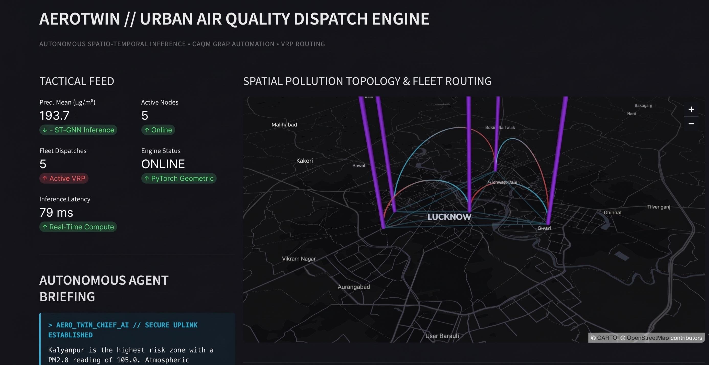
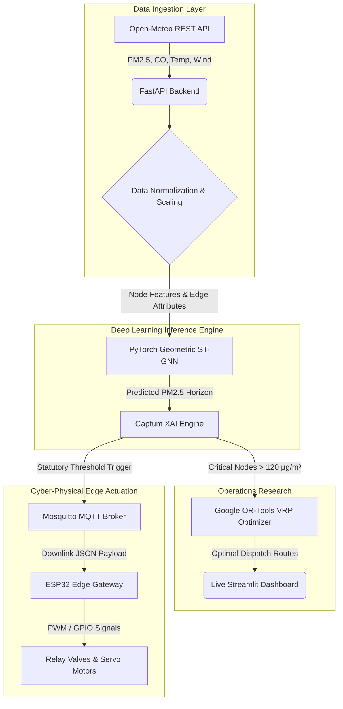

# AeroTwin: Cyber-Physical Air Quality Management System


## Executive Summary
AeroTwin is an enterprise-grade Cyber-Physical System (CPS) and digital twin platform engineered for autonomous municipal air quality management. Developed for the IBM Competition, this solution directly addresses the critical urban challenge of extreme PM2.5 atmospheric pollution. 

Instead of acting merely as a passive dashboard, AeroTwin actively closes the loop between software and the physical world. It seamlessly ingests real-time environmental telemetry, forecasts atmospheric pollution propagation using Spatio-Temporal Graph Neural Networks (ST-GNNs), dynamically routes physical mitigation assets via Operations Research integer linear programming, and autonomously dispatches downlink commands to edge microcontrollers (ESP32/Arduino) to actuate physical hardware (e.g., mist cannons, water sprinklers) in the real world.

The system is designed to completely automate the Indian government's Graded Response Action Plan (GRAP) without requiring manual human intervention.

---

## The Core Problem: The Delayed Air Quality Response Gap
In rapidly developing urban centers like Lucknow, extreme atmospheric pollution (PM2.5) events cause severe public health crises and economic disruption. Currently, municipal responses are fundamentally **reactive**. Environmental data is collected, manually analyzed by human operators on static dashboards, and subjected to bureaucratic delays before physical mitigation assets (like water sprinklers or mist cannons) are finally deployed. 

**The consequence:** By the time a mitigation asset reaches a critical pollution zone, the PM2.5 cloud has already advected (drifted) across the city, rendering the response completely ineffective.

AeroTwin solves this by predicting pollution drift *before* it happens and automatically dispatching physical assets to intercept it, entirely removing the human bottleneck.

---
## MVP Command Center


*(AeroTwin Tactical Spatial Theater, VRP Routing, and LLM Agent Briefing)*

---

## Key Features & Innovation
- **Autonomous Forecasting**: Real-time integration with Open-Meteo REST APIs feeds a PyTorch Geometric ST-GNN to predict spatial pollution drift 24 hours into the future.
- **Explainable AI (XAI) & AI Ethics**: To ensure algorithmic transparency and trustworthy AI in municipal decision-making, PyTorch Captum integration provides real-time SHAP feature attributions. This demystifies the "black-box" ST-GNN by mathematically proving which exact environmental variables (e.g., wind advection, CO levels) drove a specific PM2.5 forecast, ensuring that high-stakes statutory dispatches are legally defensible and auditable.
- **Cloud-Native Microservices Architecture**: Built for massive municipal scalability, the system decouples the inference engine (FastAPI), frontend (Streamlit), and edge-communications (MQTT) into isolated Docker containers, aligning with enterprise hybrid-cloud deployment standards.
- **Gemini LLM Diagnostics**: A continuously polling generative AI agent analyzes the GNN matrix output and formulates fluid, executive-level briefings for municipal commissioners.
- **VRP Fleet Routing**: Google OR-Tools dynamically calculate the most efficient dispatch routes for emergency mitigation vehicles to reach critical nodes (PM2.5 > 120 µg/m³).
- **Physical Edge Actuation**: Triggering a GRAP Stage III/IV event automatically dispatches MQTT payloads to local Edge Gateways, which utilize GPIO PWM signals to physically rotate servo valves and activate mist cannons.

---

## Architecture Overview



## Mathematical & Algorithmic Foundations

### 1. Spatio-Temporal Feature Engineering
To capture temporal dependencies before spatial aggregation, the system calculates lag operators and rolling windows over historical time-series data:

$$
\text{PM2.5}_{t, \text{lag}} = \text{PM2.5}_{t-1}
$$

$$
\text{PM2.5}_{\text{MA}(24)} = \frac{1}{24} \sum_{k=0}^{23} \text{PM2.5}_{t-k}
$$

### 2. PyTorch Geometric Message-Passing Graph (ST-GNN)
The spatial advection of particulate matter is modeled using a Message Passing Neural Network where wind vectors act as edge attributes modulating the transfer of pollution between geographical nodes:

$$
h_i^{(l+1)} = \text{ReLU} \left( W_{\text{update}} \cdot \left[ h_i^{(l)} \parallel \sum_{j \in \mathcal{N}(i)} \text{ReLU}\left( W_{\text{msg}} \cdot [h_j^{(l)} \parallel W_{\text{edge}} e_{j,i}] \right) \right] \right)
$$

Where $h_i$ represents the node state (chemical composition), and $e_{j,i}$ represents the edge state (wind speed and distance).

### 3. Constrained Vehicle Routing Problem (VRP)
The routing of mitigation assets from the central municipal hub is modeled as an Integer Linear Program (ILP) solved via Google OR-Tools:

$$
\text{Minimize} \sum_{i \in V} \sum_{j \in V} \sum_{k \in K} c_{ij} x_{ijk}
$$

Subject to:

$$
\sum_{j \in V} x_{0jk} = 1, \quad \forall k \in K \quad (\text{Vehicles leave the depot})
$$

$$
\sum_{i \in V} \sum_{k \in K} x_{ijk} = 1, \quad \forall j \in V \setminus \{0\} \quad (\text{Every critical node is visited exactly once})
$$

---

## Statutory Policy Automation (GRAP)

AeroTwin autonomously translates continuous atmospheric data into discrete legal policy interventions based on the Commission for Air Quality Management (CAQM) thresholds:

| Stage | PM2.5 Threshold (µg/m³) | Statutory Category | Automated Hardware Mitigation Dispatch |
| :---: | :--- | :--- | :--- |
| **Normal** | < 60.0 | Good / Moderate | Routine Monitoring (Standby) |
| **Stage I** | 60.0 - 120.0 | Poor | `MECHANIZED_ROAD_SWEEPING` |
| **Stage II** | 120.1 - 250.0 | Very Poor | `WATER_SPRINKLER_HIGH_DENSITY` |
| **Stage III** | 250.1 - 350.0 | Severe | `PRIORITY_1_MIST_CANNON_DISPATCH` |
| **Stage IV** | > 350.0 | Severe+ | `EMERGENCY_CLOSURE_AND_VEHICLE_BAN` |


## Hardware & Edge Specification

AeroTwin transcends digital software by maintaining physical authority over municipal hardware. The physical hardware mock-up utilizes a highly cost-effective **ESP32 Edge Microcontroller** to simulate field actuators.

- **Edge Compute**: The ESP32 runs a lightweight MicroPython/Python MQTT daemon.
- **Communication Protocol**: IEEE 802.11 b/g/n Wi-Fi bridging into a local `Mosquitto` MQTT broker pub/sub architecture.
- **Physical Actuation Circuit**: 
  - GPIO PWM Channel 1 -> Controls a 90° generic servo simulating a high-pressure municipal water main valve.
  - GPIO PWM Channel 2 -> Controls a 180° sweeping servo simulating an oscillating anti-smog mist cannon.
- **Fault Tolerance**: In the event of cloud-disconnect, the edge node retains local buffering and automatically triggers a safe `standby_mode` (halting active mitigation).

---

## Local Development Setup

To run the full AeroTwin digital twin locally:

1. Clone the repository and add your Gemini API key:
```bash
echo "GEMINI_API_KEY=your_key_here" > .env
```
2. Spin up the containerized microservices:
```bash
docker compose up -d --build
```
3. Access the Live Command Center:
Navigate to `http://localhost:8501` to view the Streamlit UI, trigger spike simulations, and view the live VRP map.

---

## Author & Academic Attribution

**Alfayez Ahmad**  
Department of Computer Science & Engineering  
Specialization: Cloud Computing & Artificial Intelligence  
Integral University, Lucknow, India  

*Distributed under the MIT License. Copyright © 2026 Alfayez Ahmad.*